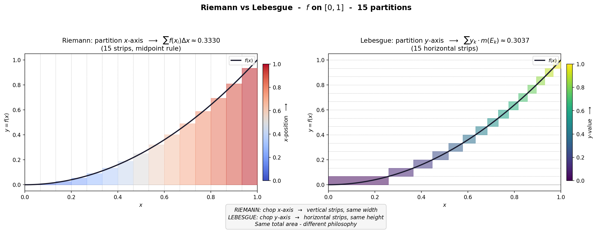
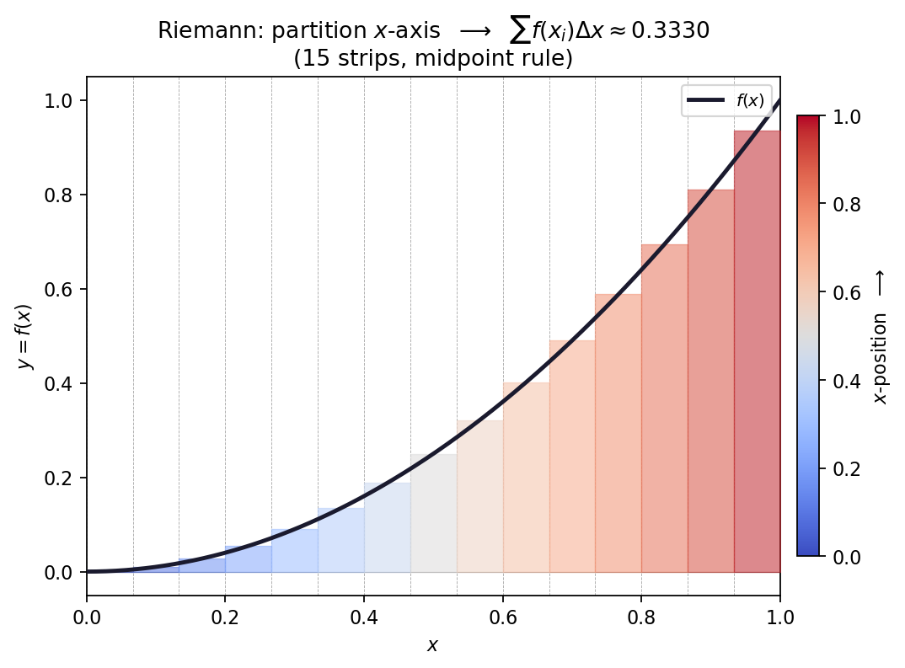
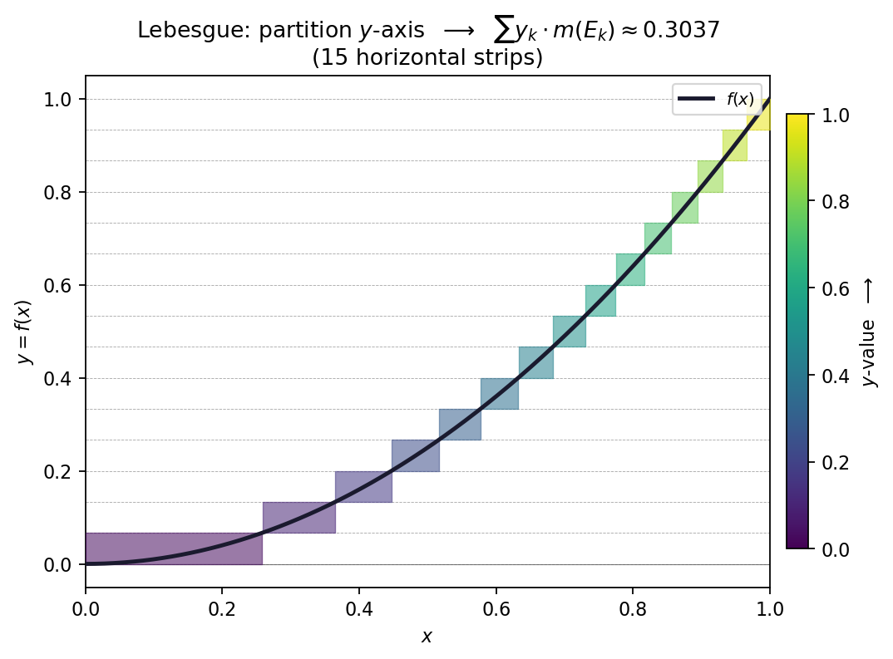
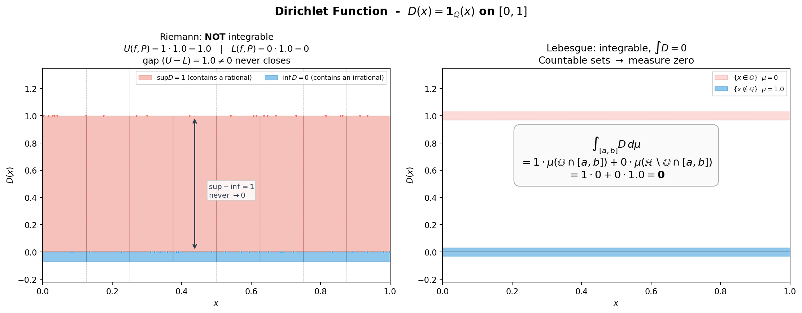

<div align="center">

# realviz — Real Analysis Visualizations

**See Riemann and Lebesgue integration side by side. Measure theory for the eyes.**

[](https://github.com/HunterZ549/realviz/actions/workflows/ci.yml)
[](https://www.python.org/)
[](LICENSE)
[](tests)

> Real analysis is abstract until you **see** it. `realviz` draws the two great
> theories of integration on the same function — so the difference finally clicks.



</div>

---

## What's the big idea?

Every calculus student learns Riemann integration first: chop the **x-axis** into
vertical strips, add up `f(xᵢ)·Δx`. Lebesgue integration flips it around — chop the
**y-axis** instead, group points by their function value, and weigh each slice by
the *measure* of its preimage: `Σ yₖ·m(Eₖ)`.

| Riemann partitions the x-axis | Lebesgue partitions the y-axis |
|:---:|:---:|
|  |  |
| Same-width **vertical** strips | Same-height **horizontal** slices |
| Sum: `Σ f(xᵢ) · Δx` | Sum: `Σ yₖ · m(Eₖ)` |
| Strip color = **x-position** | Slice color = **y-value** |

Same total area. Completely different philosophy.

## Where Riemann breaks: the Dirichlet function

`D(x) = 1` if `x` is rational, `0` otherwise. Every sub-interval of `[0,1]` contains
both a rational and an irrational — so the upper sum is always `1`, the lower sum
always `0`, and the gap *never closes*. Riemann gives up.

Lebesgue measures the irrationals (`1`) and the rationals (`0`), and gets a clean
answer: **`∫D = 0`**. This single function motivated a whole field.



## Install

```bash
pip install realviz            # once on PyPI
# today:
pip install -e .
```

## Quick start

```python
from realviz import compare_integrals, riemann_plot, lebesgue_plot

# Side-by-side comparison — the main event
compare_integrals(lambda x: x**2, 0, 1, n_partitions=15)

# Or inspect each method alone
riemann_plot(lambda x: x**2, 0, 1, n_partitions=10, method="midpoint")
lebesgue_plot(lambda x: x**2, 0, 1, n_partitions=10)

# The Dirichlet function — where Riemann fails, Lebesgue succeeds
from realviz import dirichlet_illustration
dirichlet_illustration()
```

### Try it yourself

```bash
python examples/demo_compare.py     # x² and sin(x), side by side
python examples/demo_dirichlet.py   # the Dirichlet illustration
```

## Design principles

- **Safe by default** — strict input validation: functions are sampled defensively,
  partition counts are bounded, no `eval`/`exec`/`pickle`, no network, no file I/O.
- **Pedagogical color** — every strip is colored by *what is being partitioned*,
  so the axis-choice is visible at a glance.
- **Zero magic** — pure NumPy + Matplotlib, ~300 lines of core code, MIT licensed.

## Roadmap

- [x] `v0.1.0` — Riemann vs Lebesgue integral comparison + Dirichlet illustration
- [ ] `v0.2.0` — Cantor set construction, step by step
- [ ] `v0.3.0` — Simple-function approximation of measurable functions
- [ ] `v0.4.0` — Convergence modes (pointwise, uniform, a.e., in L¹)
- [ ] `v0.5.0` — Vitali set and non-measurable sets (conceptual)

## Development

```bash
git clone https://github.com/HunterZ549/realviz.git
cd realviz
pip install -e ".[dev]"
pytest               # 53 tests, CI runs Python 3.9–3.12
```

## License

MIT — see [LICENSE](LICENSE).
